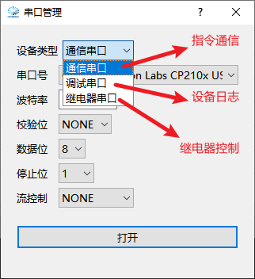
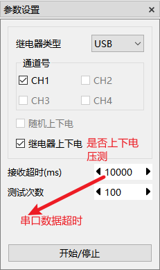

# 奥比猫眼压测工具

## 1. 介绍

主要用于猫眼串口通信设备，进行常规指令收发压测。也可通过shell命令进行功能压测；  
界面分几个区域：任务配置、设备日志接收打印、参数设置等构成;

## 2. 界面截图

## 3. 功能使用

### 3.1 设备配置

首先点击菜单栏“**系统设置**”>>“**设备配置**”，弹出配置界面。配置对应串口信息后，关闭窗口。

### 3.2 任务信息设置

1. 根据需要设置命令码
2. 单击“**发送**”按钮,手动发送
3. 鼠标右键弹出菜单栏，进行数据新增、删除、勾选、加载任务、保存任务等操作
4. 勾选需要执行压测的命令
5. 使用离线任务文件加载可以快速配置压测任务

### 3.3 参数设置

1. 选择继电器类型
2. 启用对应连接通道号
3. 确认是否需要上下电压测
4. 配置测试次数
5. 点击“**开始/停止**”按钮进行压测

### 3.4 任务自动压测截图

### 3.5 设备日志界面

* 支持背景色修改
* 字体修改
* 字体颜色修改
* 自动保存日志文件,勾选后才会开始保存文件
* 往设备端发送数据功能

### 3.6 状态栏显示

* 支持当前压测状态显示
* 支持当前任务进度显示

## 4. 版本更新

|版本号|功能点|日期|
|------|------|----|
|V1.0.0.1 |第一版发布,提供基本功能| 2023.6.6|
|V1.0.0.2 |新增多通道压测功能，备注框输入;| 2023.8.10|
||新增csv任务列表离线文件加载、保存功能||
||新增QtAES库、md5校验、奥比协议解析接口||
||新增状态栏信息显示、任务命令码补全列表||
||优化其他若干已知问题||
